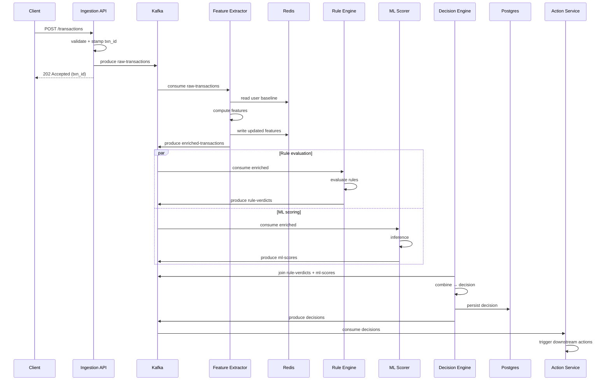
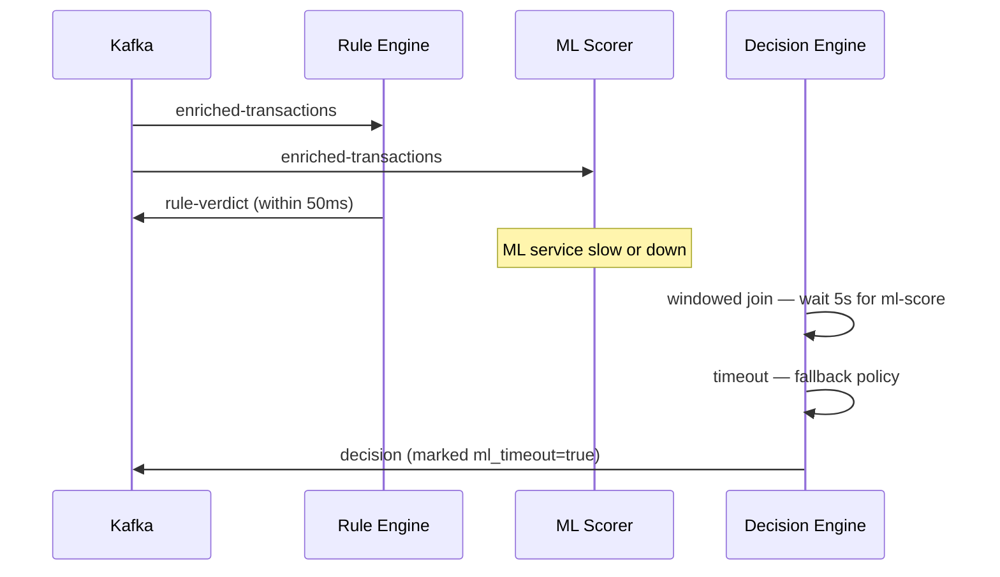
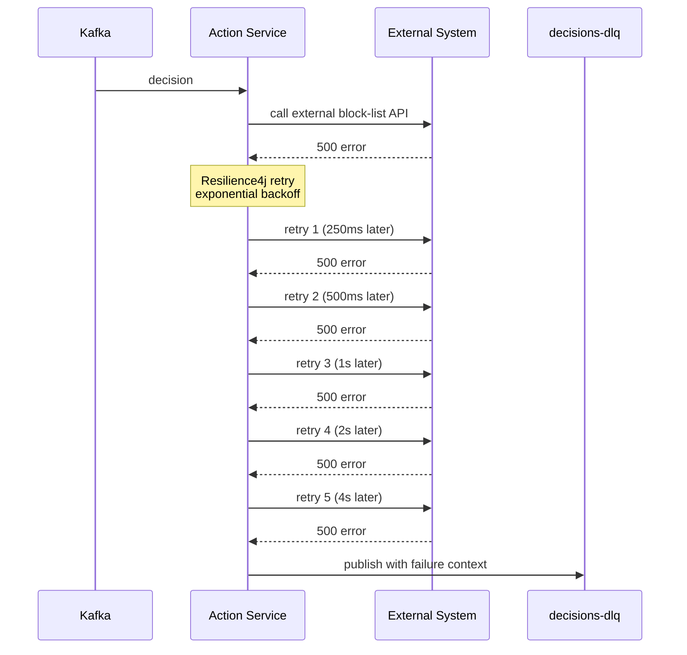
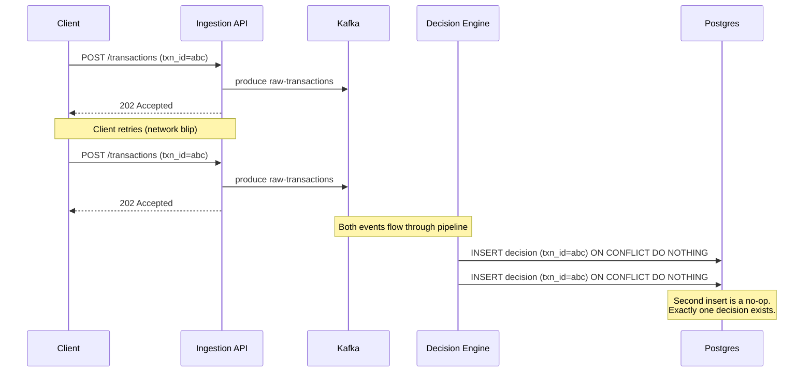
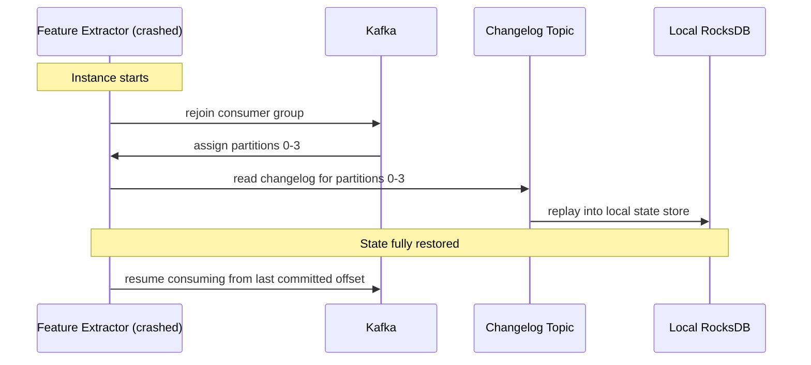

# Sequence diagrams

Happy-path and failure-mode flows for the key pipeline scenarios. Rendered with Mermaid.

## 1. Happy path — transaction reaches a decision

## 2. ML scorer timeout — decision made on rule verdict alone

## 3. Action service failure with retry + DLQ

## 4. Idempotent replay — same transaction submitted twice

## 5. Feature extractor restart — state recovery

